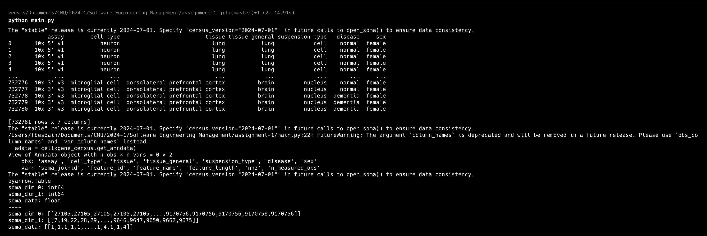

# Requirements
- Python >= 3.10

# Installation

```bash
python -m venv ./venv
source ./venv/bin/activate
pip install -r requirements.txt
```

# Usage

```bash
source ./venv/bin/activate
python main.py
```

